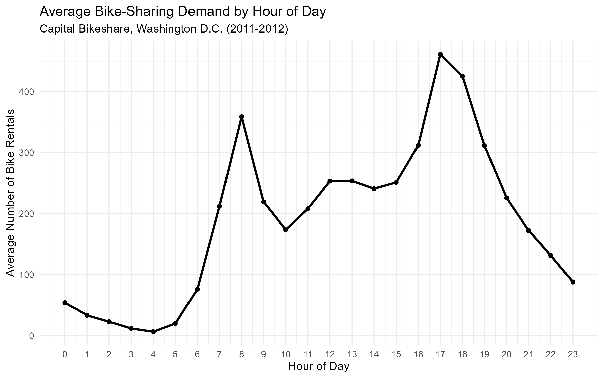
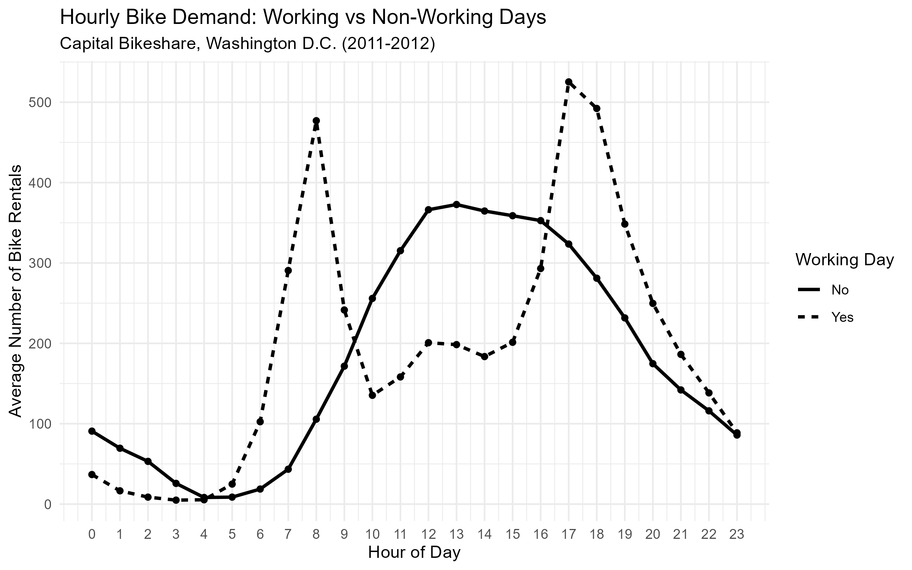
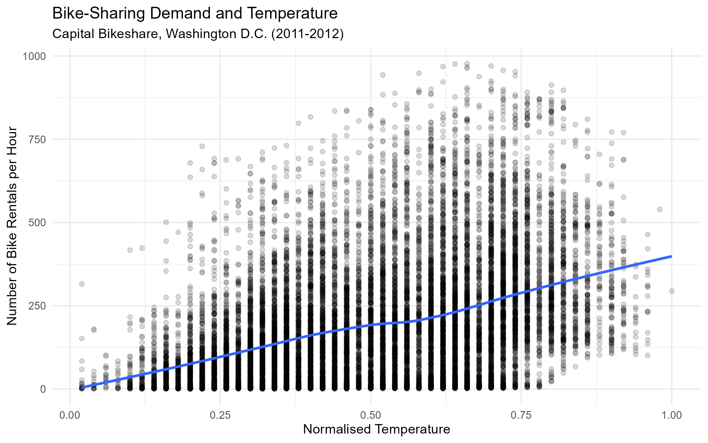
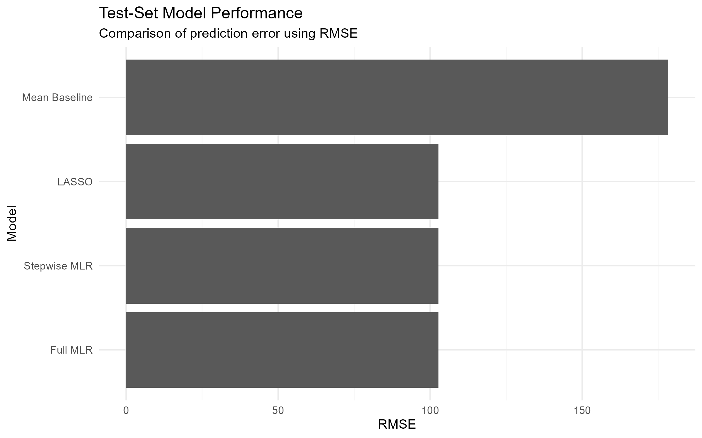
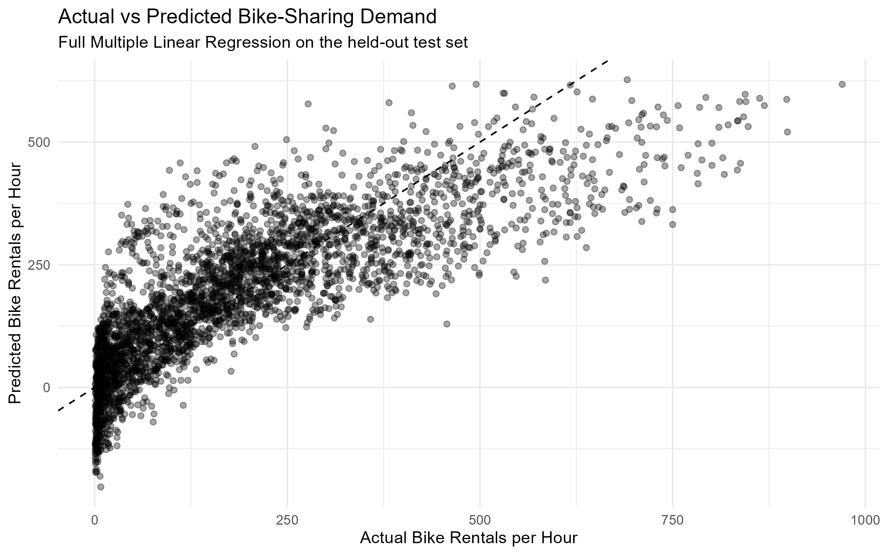
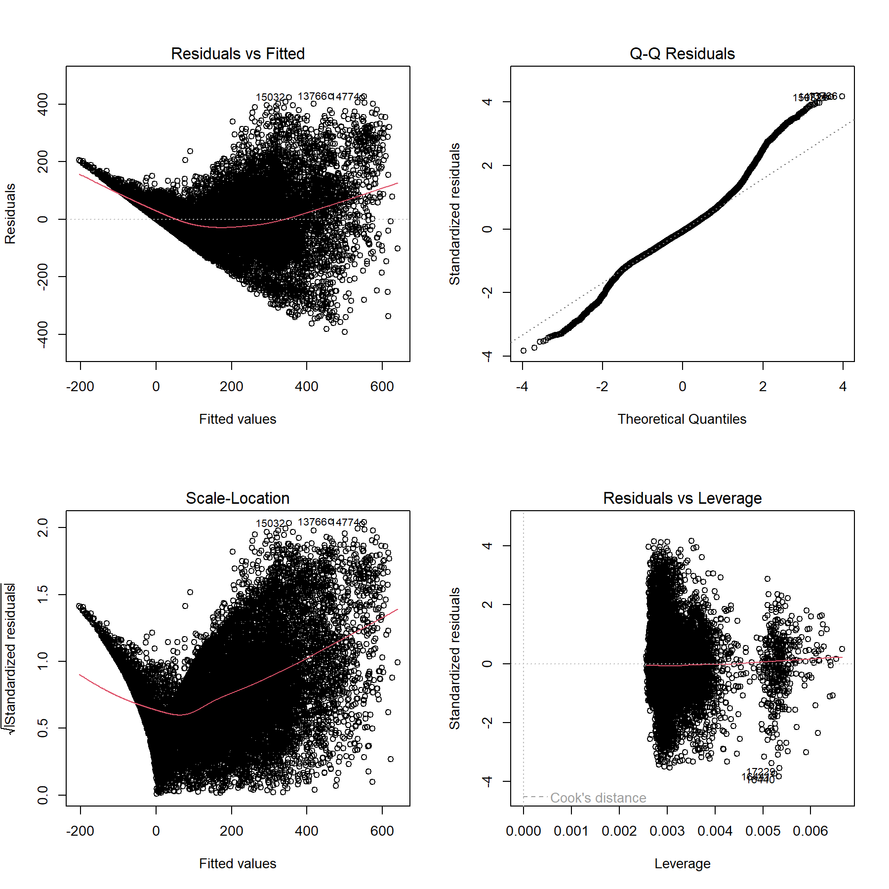
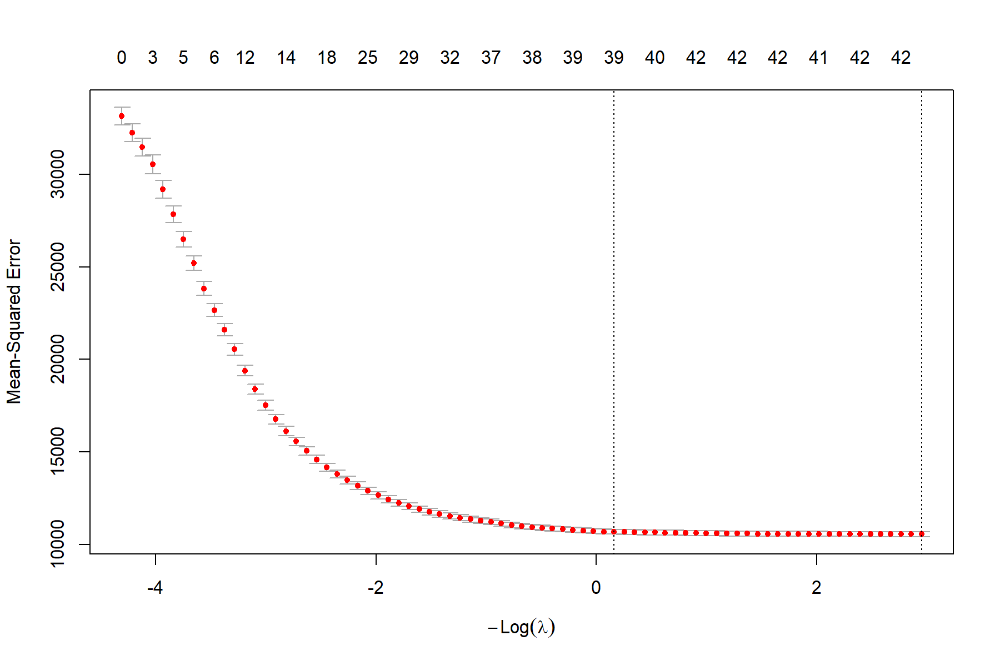

# Urban Bike-Sharing Demand Analysis

## Project Overview

This project analyses hourly bike-sharing demand using the UCI Bike Sharing Dataset, which contains Capital Bikeshare rental data from Washington D.C. for 2011–2012.

The aim of the analysis is to investigate how weather, calendar, and temporal factors are associated with hourly bike-sharing demand and to compare different regression approaches for predicting the number of hourly bike rentals.

The project compares a mean baseline model with:

- Multiple Linear Regression (MLR)
- Backward Stepwise Regression using AIC
- LASSO Regression with 10-fold cross-validation

Model performance is evaluated on a held-out test set using Root Mean Squared Error (RMSE), Mean Absolute Error (MAE), and R-squared (R²).

## Dataset

The analysis uses the **Bike Sharing Dataset** from the UCI Machine Learning Repository. The dataset contains hourly bike rental records from the Capital Bikeshare system in Washington D.C. during 2011 and 2012.

The target variable used in this project is:

- `cnt` — total number of bike rentals per hour.

The analysis considers a combination of temporal, calendar, and weather-related variables, including year, month, hour of day, holiday status, working-day status, weather conditions, temperature, humidity, and windspeed.

Before modelling, the dataset was checked for missing values, duplicate observations, and invalid negative values in the target variable. Categorical variables were converted to factors before exploratory analysis and modelling.

### Variables Excluded from Modelling

Three available variables were deliberately excluded from the regression models:

- `atemp` — excluded because it overlaps strongly with `temp`, helping avoid redundant temperature predictors.
- `season` — excluded because month indicators already capture seasonal timing.
- `weekday` — excluded because working-day and holiday indicators were used to represent the main calendar distinction of interest.

**Source:** [UCI Machine Learning Repository — Bike Sharing Dataset](https://archive.ics.uci.edu/dataset/275/bike+sharing+dataset) 

**Dataset DOI:** `10.24432/C5W894`

## Methodology

### Train-Test Split

The modelling dataset was randomly divided into:

- **80% training data** — used to fit the models.
- **20% test data** — used to evaluate model performance on held-out observations.

A random seed of `42` was used to make the split reproducible.

Because the observations were randomly split, the test results measure generalisation to held-out observations within the 2011–2012 dataset. The analysis should therefore not be interpreted as an evaluation of future time-series forecasting performance.

### Baseline Model

A simple baseline model was created by predicting the mean bike demand from the training set for every observation in the test set. This provides a reference point for determining whether the regression models offer meaningful improvements in predictive performance.

### Multiple Linear Regression

A Multiple Linear Regression (MLR) model was fitted using year, month, hour of day, holiday status, working-day status, weather conditions, temperature, humidity, and windspeed as predictors.

Regression diagnostic plots were examined to assess model assumptions. The diagnostics indicated some nonlinearity, non-constant residual variance, and departures from normality. The MLR is therefore treated as an interpretable regression benchmark rather than a model with perfectly satisfied assumptions.

Multicollinearity was also assessed using Variance Inflation Factor (VIF) diagnostics.

### Backward Stepwise Regression

Backward stepwise model selection was performed using Akaike Information Criterion (AIC), starting from the full MLR specification.

The procedure retained all predictors from the full model, resulting in the same final specification as the Full MLR.

### LASSO Regression

LASSO regression was fitted using `glmnet`. The regularisation parameter was selected using 10-fold cross-validation, with `lambda.min` used for the primary model comparison.

At the selected `lambda.min`, all 42 encoded predictor coefficients were retained, meaning that LASSO did not produce a sparser predictor set at the cross-validated minimum.

### Model Evaluation

Models were evaluated on the same held-out test set using:

- **RMSE (Root Mean Squared Error)** — measures the typical magnitude of prediction errors while giving greater weight to larger errors.
- **MAE (Mean Absolute Error)** — measures the average absolute prediction error.
- **R² (R-squared)** — measures the proportion of test-set variation accounted for by the model relative to predicting the test-set mean.

## Results

### Model Performance

All three regression approaches substantially improved on the mean baseline model.

| Model | RMSE | MAE | R² |
|---|---:|---:|---:|
| Mean Baseline | 178.315 | 141.199 | 0.000 |
| Full MLR | 102.747 | 76.131 | 0.668 |
| Stepwise MLR | 102.747 | 76.131 | 0.668 |
| LASSO | 102.774 | 76.105 | 0.668 |

The Full MLR reduced test-set RMSE by approximately **42.38%** compared with the mean baseline.

The Full MLR and Stepwise MLR produced effectively identical test-set performance because backward AIC retained the complete Full MLR specification. LASSO also produced very similar predictive performance.

Although the Full MLR had the lowest unrounded test-set RMSE, the differences between the three regression approaches were very small. The Full MLR is therefore used as the main interpretable regression benchmark rather than being presented as substantially better than the other regression approaches.

### Key Findings

The analysis showed clear temporal patterns in bike-sharing demand, particularly across different hours of the day. Weather and environmental conditions were also associated with differences in hourly demand.

The Full MLR explained approximately **66.8% of the variation in the held-out test observations** according to test-set R².

Regression diagnostics indicated that the linear model does not perfectly capture the structure of bike demand. In particular, the diagnostic plots suggested some nonlinearity, non-constant residual variance, and departures from normality. Predictions also showed limitations at higher levels of bike demand.

These findings mean that the Full MLR is useful as an interpretable benchmark, while its coefficients and predictions should be interpreted with the model's diagnostic limitations in mind.

## Visualisations

### Hourly Demand Pattern

Bike-sharing demand varies substantially throughout the day, highlighting the importance of hour-of-day effects in the regression models.



### Working Days vs Non-Working Days

The hourly demand profile differs between working and non-working days, showing how usage patterns change depending on the type of day.



### Temperature and Bike Demand

The exploratory analysis indicates a positive but nonlinear relationship between normalised temperature and hourly bike demand.



### Model Performance

All three regression approaches substantially outperform the mean baseline, while their test-set RMSE values are very similar.



### Actual vs Predicted Demand

The Full MLR predictions generally follow the observed demand pattern, although prediction accuracy decreases for some high-demand observations.



### Regression Diagnostics

Diagnostic plots were used to assess the assumptions and limitations of the Full MLR. They indicate some nonlinearity, non-constant residual variance, and departures from normality.



### LASSO Cross-Validation

Ten-fold cross-validation was used to select the regularisation parameter for the LASSO model.



## Project Structure

```text
urban-bike-demand-analysis/
│
├── README.md
│
├── R/
│   └── bike_demand_regression_analysis.R
│
├── data/
│   └── hour.csv
│
└── outputs/
    ├── figures/
    │   ├── actual_vs_predicted.png
    │   ├── demand_distribution.png
    │   ├── full_mlr_diagnostics.png
    │   ├── hourly_demand.png
    │   ├── hourly_workingday_demand.png
    │   ├── lasso_cross_validation.png
    │   ├── model_comparison.png
    │   ├── temperature_demand.png
    │   └── weather_demand.png
    │
    ├── tables/
    │   ├── full_mlr_coefficients.csv
    │   ├── lasso_coefficients.csv
    │   ├── model_comparison.csv
    │   └── vif_results.csv
    │
    └── session_info.txt
```

## Reproducibility

The analysis was conducted in R. A fixed random seed (`42`) is used for the train-test split and LASSO cross-validation to improve reproducibility.

The main packages used are:

- `tidyverse` — data manipulation and visualisation
- `car` — multicollinearity diagnostics
- `MASS` — backward stepwise model selection
- `glmnet` — LASSO regression and cross-validation

If these packages are not already installed, they can be installed with:

```r
install.packages(c("tidyverse", "car", "MASS", "glmnet"))
```

Package and R version information generated during the analysis is stored in:

```text
outputs/session_info.txt
```

To reproduce the analysis:

1. Clone or download this repository.
2. Ensure the dataset is stored at `data/hour.csv`.
3. Open the project directory in RStudio.
4. Run `R/bike_demand_regression_analysis.R` from beginning to end.

The script performs the data validation, exploratory analysis, model fitting, evaluation, and generation of the figures and tables used in this repository.

## Limitations

This project has several limitations that should be considered when interpreting the results:

- The train-test split is random rather than chronological. Therefore, the reported test performance measures generalisation to held-out observations from the 2011–2012 period rather than performance on genuinely future observations.
- The Full MLR diagnostic plots indicate some nonlinearity, non-constant residual variance, and departures from normality.
- The linear regression models may not fully capture complex nonlinear relationships or interactions between predictors.
- The analysis uses historical Capital Bikeshare data from Washington D.C., so the findings should not automatically be generalised to other bike-sharing systems, locations, or time periods.
- The analysis identifies statistical associations between predictors and bike demand. The regression coefficients should not be interpreted as evidence of causal effects.

These limitations provide opportunities for future work, such as evaluating models using chronological validation and comparing the regression approaches with nonlinear predictive methods.

## Data Source and Attribution

The dataset used in this project is the **Bike Sharing Dataset** from the UCI Machine Learning Repository.

The data were originally associated with the following research:

> Fanaee-T, H. and Gama, J. (2014). Event labeling combining ensemble detectors and background knowledge. *Progress in Artificial Intelligence, 2*, 113–127.

**Dataset:** Bike Sharing  
**Repository:** UCI Machine Learning Repository  
**DOI:** `10.24432/C5W894`

The dataset contains Capital Bikeshare rental information from Washington D.C. for 2011 and 2012.

## Author

This project was developed as part of my data analytics portfolio to demonstrate practical skills in:

- R programming
- Data cleaning and validation
- Exploratory data analysis
- Data visualisation
- Multiple Linear Regression
- Model diagnostics
- Model selection
- LASSO regularisation
- Cross-validation
- Predictive model evaluation
- Reproducible analysis
